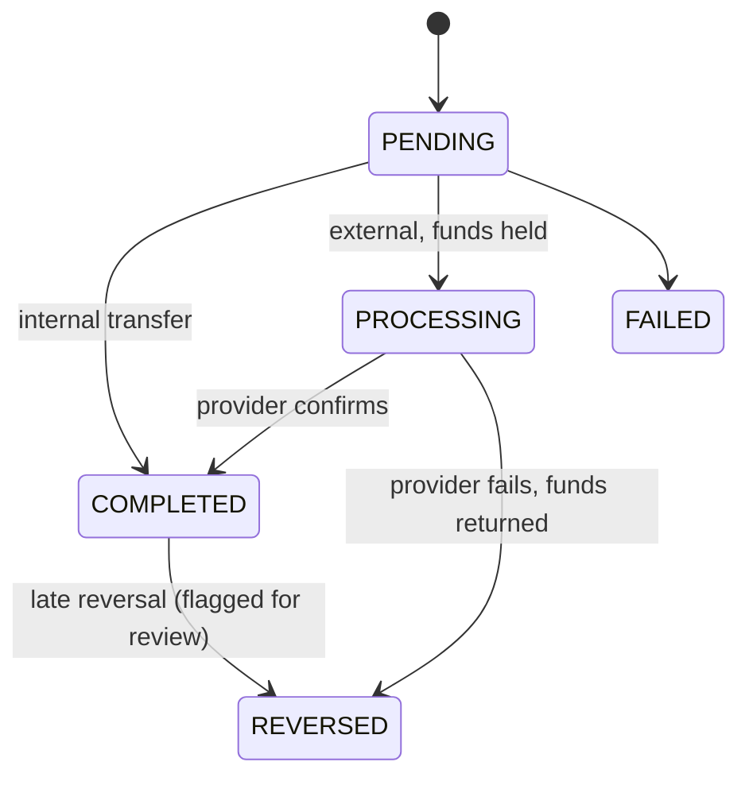
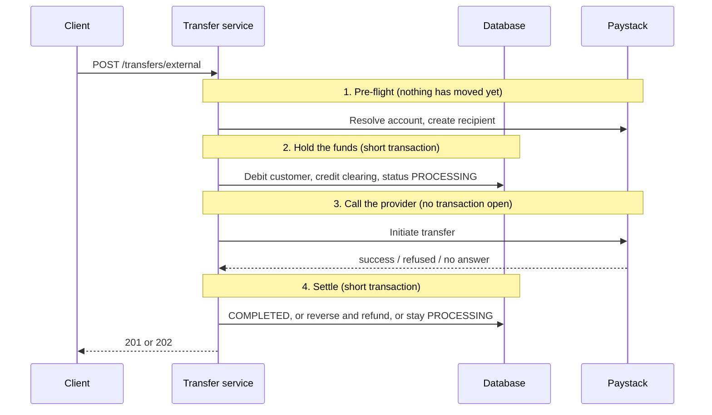

# PayBridge

A Spring Boot **modular monolith** that simulates core banking: customer accounts, a double-entry ledger, internal transfers between accounts, and external payouts to Nigerian bank accounts through the **Paystack** sandbox.

It is a learning project, built one module at a time, with the goal of understanding how real money-movement systems behave: atomicity, idempotency, concurrency, provider failures and reconciliation. Everything runs in **sandbox mode**. No real money moves.

| | |
|---|---|
| **Live demo** | https://paybridge-xssx.onrender.com |
| **Swagger UI** | https://paybridge-xssx.onrender.com/swagger-ui/index.html |
| **Health check** | https://paybridge-xssx.onrender.com/actuator/health |

> **First visit is slow.** The demo runs on a free tier that sleeps after about 15 minutes without traffic. The first request after a sleep can take one to three minutes while the application starts. Open the health-check link above first, wait for `{"status":"UP"}`, then use Swagger.

---

## Contents

1. [Try it in five minutes (Swagger walkthrough)](#try-it-in-five-minutes-swagger-walkthrough)
2. [Things worth trying](#things-worth-trying)
3. [API reference at a glance](#api-reference-at-a-glance)
4. [Error format and codes](#error-format-and-codes)
5. [How it works](#how-it-works)
6. [Run it locally](#run-it-locally)
7. [Configuration](#configuration)
8. [Deployment](#deployment)
9. [Sandbox notes and limitations](#sandbox-notes-and-limitations)
10. [Project structure](#project-structure)
11. [Troubleshooting](#troubleshooting)

---

## Try it in five minutes (Swagger walkthrough)

Open the **Swagger UI** link above. You will move money in six steps. Each step names the endpoint, shows the JSON to send, and says what you should see.

### Step 1. Register and get your API key

Endpoint: **`POST /api/v1/customers/register`** (open it, click **Try it out**)

```json
{
  "fullName": "Ada Lovelace",
  "email": "ada@example.com"
}
```

**Expected:** `201 Created`. Copy the `apiKey` value from the response (it starts with `pbk_`).

> The key is shown **once**. The server stores only a hash of it, so it cannot be recovered. If you lose it, register again with a different email.

### Step 2. Authorize Swagger with your key

Click the **Authorize** button at the top right of the page, paste the key into the `apiKey` field, click **Authorize**, then **Close**. Every request you send from now on carries it in the `X-API-Key` header.

Check it worked with **`GET /api/v1/customers/me`**. You should get `200` and your `customerId`.

### Step 3. Open two accounts

Endpoint: **`POST /api/v1/accounts`**. Run it twice.

```json
{
  "currency": "NGN"
}
```

**Expected:** `201 Created` each time, with a 10-digit `accountNumber` and `balance` of `"0.00"`. Call **`GET /api/v1/accounts`** to see both, and note the two account numbers. Call them **A** and **B**.

> You never send a customer ID. The server knows who you are from your API key and links the account to you.

### Step 4. Add test money to account A

Endpoint: **`POST /api/v1/sandbox/fund`**

Set the **`Idempotency-Key`** header field to any unique text, for example `fund-001`. Then send:

```json
{
  "accountNumber": "ACCOUNT_A_NUMBER",
  "amount": 5000.00
}
```

**Expected:** `200 OK`, `"replayed": false`, and `"balance": "5000.00"`.

### Step 5. Transfer from A to B (internal transfer)

Endpoint: **`POST /api/v1/transfers`**, with header `Idempotency-Key: trf-001`:

```json
{
  "sourceAccountNumber": "ACCOUNT_A_NUMBER",
  "destinationAccountNumber": "ACCOUNT_B_NUMBER",
  "amount": 2000.00,
  "narration": "Rent contribution"
}
```

**Expected:** `201 Created` and `"status": "COMPLETED"`. Confirm with `GET /api/v1/accounts`: A holds `3000.00` and B holds `2000.00`.

### Step 6. Send money to a bank account (external transfer via Paystack)

Endpoint: **`POST /api/v1/transfers/external`**, with header `Idempotency-Key: ext-001`:

```json
{
  "sourceAccountNumber": "ACCOUNT_A_NUMBER",
  "destinationAccountNumber": "0123456789",
  "destinationBankCode": "001",
  "amount": 500.00,
  "narration": "Invoice 1042"
}
```

> **Use bank code `001` and any 10-digit account number.** `001` is Paystack's *test bank*. Paystack's test mode allows only three lookups of real bank accounts per day for the whole sandbox key, so real account numbers will quickly stop working. See [Sandbox notes](#sandbox-notes-and-limitations).

**Expected:** `201 Created` with `"status": "COMPLETED"` (Paystack's test mode always succeeds), or `202 Accepted` with `"status": "PROCESSING"` if the provider has not confirmed yet. For a `PROCESSING` transfer, call **`POST /api/v1/transfers/{id}/refresh`** to ask the provider for the outcome. The system also checks automatically every minute.

Look up any transfer later with **`GET /api/v1/transfers/{id}`**.

---

## Things worth trying

Each of these shows a real banking behaviour. Use the accounts from the walkthrough.

| Try this | You should see | What it demonstrates |
|---|---|---|
| Send the **same request again** with the **same** `Idempotency-Key` | `200` and `"replayed": true`. The balance does not change a second time. | **Idempotency.** A retry never moves money twice. |
| Reuse an `Idempotency-Key` with a **different amount** | `409` `IDEMPOTENCY_CONFLICT` | A key is bound to one specific request. |
| Transfer more than the balance | `422` `INSUFFICIENT_FUNDS` | The balance check happens under a row lock, so it cannot be raced. |
| Transfer from an account to itself | `422` `SAME_ACCOUNT_TRANSFER` | Input rules enforced by the service. |
| Click **Authorize → Logout**, then call any account endpoint | `401` `UNAUTHENTICATED` | Every protected endpoint requires a key. |
| Register a **second customer**, authorize with *their* key, then `GET /api/v1/accounts/{one of your account numbers}` | `404` `ACCOUNT_NOT_FOUND` | **Ownership checks.** Other people's accounts look as if they do not exist, so account numbers cannot be probed. |
| As that second customer, try to **transfer from your account** | `404` | You cannot spend from an account you do not own. |
| Send more than about 20 money-moving requests in a minute | `429` `RATE_LIMITED` with a `Retry-After` header | **Rate limiting.** |
| Send `"amount": 10.005` | `422` `INVALID_AMOUNT` | Money has at most two decimal places, and the system never rounds silently. |

---

## API reference at a glance

All endpoints are under `/api/v1`. Everything except registration, the webhook, Swagger and the health check needs the `X-API-Key` header. The full, interactive reference is in Swagger UI.

| Method and path | Purpose | Notes |
|---|---|---|
| `POST /customers/register` | Create a customer and receive an API key | Public. Limited to 5 per hour per address. |
| `GET /customers/me` | Show who the current key belongs to | |
| `POST /accounts` | Open an NGN or USD account | Up to 10 accounts per customer |
| `GET /accounts` | List your accounts | |
| `GET /accounts/{accountNumber}` | Get one of your accounts | `404` if it is not yours |
| `POST /sandbox/fund` | Add test money to one of your NGN accounts | Needs `Idempotency-Key`. Sandbox only. |
| `POST /transfers` | Transfer from your account to any PayBridge account | Needs `Idempotency-Key` |
| `POST /transfers/external` | Send to a Nigerian bank account via Paystack | Needs `Idempotency-Key`. Returns `201`, `202` or `200`. |
| `GET /transfers/{id}` | Get one of your transfers | |
| `POST /transfers/{id}/refresh` | Ask the provider about a `PROCESSING` transfer | Safe to call repeatedly |
| `GET /banks?name=` | List Nigerian banks and their codes | Rate limited (calls Paystack) |
| `GET /banks/resolve?accountNumber=&bankCode=` | Name enquiry: who owns this account? | Rate limited (calls Paystack) |
| `POST /webhooks/paystack` | Receives Paystack's signed events | Called by Paystack, hidden from Swagger |

**Conventions**

- **Amounts in requests** are naira with up to two decimals (`1500.50`), between `0.01` and `10,000,000.00`.
- **Amounts in responses** come in two forms: `amountMinor` (an exact integer in kobo) and `amount` (a string such as `"1500.50"`). Both are given so no client ever has to parse a floating-point number.
- **`Idempotency-Key`** is 1 to 80 characters. Keys are private to each customer, so two people can use the same text without clashing.
- **HTTP status describes the request, not the payment.** `202 Accepted` on an external transfer means "received, still in progress". The `status` field in the body is the real state of the payment.

---

## Error format and codes

Errors use the standard **Problem Details** format (RFC 9457) with a stable machine-readable `code`:

```json
{
  "title": "INSUFFICIENT_FUNDS",
  "status": 422,
  "detail": "Account 4017203596 has insufficient funds",
  "code": "INSUFFICIENT_FUNDS"
}
```

| Code | HTTP | Meaning |
|---|---|---|
| `UNAUTHENTICATED` | 401 | Missing or invalid `X-API-Key` |
| `ACCOUNT_NOT_FOUND` | 404 | No such account, **or it is not yours** (deliberately indistinguishable) |
| `TRANSFER_NOT_FOUND` | 404 | No such transfer |
| `IDEMPOTENCY_CONFLICT` | 409 | The `Idempotency-Key` was already used for a different request |
| `EMAIL_ALREADY_REGISTERED` | 409 | That email already has an account |
| `DATA_CONFLICT` | 409 | A concurrent identical request won the race. Retry. |
| `INSUFFICIENT_FUNDS` | 422 | The debit would overdraw the account |
| `INVALID_AMOUNT` | 422 | Zero, negative, or more than two decimal places |
| `CURRENCY_MISMATCH` | 422 | Accounts or amounts in different currencies |
| `SAME_ACCOUNT_TRANSFER` | 422 | Source and destination are the same account |
| `ACCOUNT_NOT_ACTIVE` | 422 | The account is frozen or closed |
| `ACCOUNT_LIMIT_REACHED` | 422 | A customer may hold at most 10 accounts |
| `UNSUPPORTED_CURRENCY` | 422 | Sandbox funding and external transfers are NGN only |
| `INVALID_IDEMPOTENCY_KEY` | 422 | The key is blank or longer than 80 characters |
| `PROVIDER_REJECTED` | 422 | Paystack refused the request. Nothing was sent and no money moved. |
| `RATE_LIMITED` | 429 | Too many requests. See the `Retry-After` header. |
| `PROVIDER_UNAVAILABLE` | 503 | Paystack did not give a reliable answer. See [below](#external-transfers-and-the-unknown-outcome). |
| `PROVIDER_NOT_CONFIGURED` | 503 | The server has no Paystack key configured |

Rate limits (per customer, or per address when not logged in):

| Group | Limit |
|---|---|
| Money-moving `POST`s (accounts, transfers, funding) | 20 per minute |
| Bank list and name enquiry | 20 per minute |
| Everything else | 120 per minute |
| Registration | 5 per hour per address |

---

## How it works

### Modules

PayBridge is a single deployable application split into modules with strict boundaries. **A module may only use another module through its `api/` package**, never its repositories or services directly.

| Module | Status | Responsibility |
|---|---|---|
| `shared` | Implemented | `Money` value object, error handling, idempotency helpers, configuration |
| `customer` | Implemented | Registration, API-key authentication (Spring Security), the "current customer" |
| `account` | Implemented | Customer and system accounts, balances, locked credit and debit |
| `ledger` | Implemented | Append-only double-entry bookkeeping, sandbox funding |
| `transfer` | Implemented | Internal and external transfers, Paystack integration, webhooks, reconciliation |
| `fx`, `remittance`, `settlement`, `compliance`, `notification` | Scaffolded only | Planned. The packages exist but contain no code yet. |

### Money is never a floating-point number

Amounts are stored as whole **kobo** (`long`) together with a currency. `0.1 + 0.2` is not `0.3` in floating point, and across millions of transactions those errors become missing money. Overflow uses `Math.addExact`, which throws instead of silently wrapping. This also matches Paystack, whose API takes amounts in kobo.

### Double-entry ledger

Every movement is recorded as two or more entries that must balance: total debits equal total credits. A `CREDIT` increases an account balance and a `DEBIT` decreases it, like a bank alert.

| Event | Debit | Credit |
|---|---|---|
| Sandbox funding of ₦5,000 | `SANDBOX_FUNDING` (system) | Customer |
| Internal transfer of ₦2,000 | Sender | Receiver |
| External payout of ₦500 | Customer | `PAYSTACK_CLEARING` (system) |
| Reversal of a failed payout | `PAYSTACK_CLEARING` | Customer |

Rules the system enforces:

- A posting that does not balance **cannot be constructed**.
- Ledger rows are **append-only**. Java marks them read-only and a database trigger refuses `UPDATE` and `DELETE`. Mistakes are corrected with a reversal, never an edit.
- Each posting has a unique `reference`, which makes retries safe.
- The sum of all account balances in the system is always **zero**.

### Concurrency

Debits and credits run under **pessimistic row locks** (`SELECT ... FOR UPDATE`), so two simultaneous transfers cannot both spend the same money. Accounts are always locked in the same order (sorted by ID), which prevents the classic deadlock where A pays B while B pays A. The test suite fires these exact races against a real database.

### Transfer lifecycle



Illegal jumps are rejected in code, so a transfer can never be both failed and completed.

### External transfers and the unknown outcome

An external transfer runs in four phases, and **no database transaction is ever held open while waiting for the network**:



The important rule is that **a timeout is not a failure**. If Paystack does not answer, the request may or may not have been processed, so the customer is **not** refunded yet. The transfer stays `PROCESSING` until the system asks Paystack directly:

| What Paystack says | Result |
|---|---|
| Found, success | `COMPLETED`. No refund, because the money did go out. |
| Found, failed or reversed | `REVERSED`. The customer is refunded. |
| No record of it (after a grace period) | `REVERSED`. The request never arrived. |
| Still pending | Stays `PROCESSING`. |

Three things can settle a `PROCESSING` transfer: the original response, a **signed webhook** from Paystack, and a **reconciliation job** that runs every minute. They are all idempotent: the transfer row is locked and a settled transfer ignores further updates, so a refund can never happen twice.

### Webhooks

`POST /api/v1/webhooks/paystack` verifies Paystack's `x-paystack-signature` header (an HMAC-SHA512 of the **raw request body**, compared in constant time) before reading anything. Valid events are stored in an audit table, the amount is cross-checked against the transfer, and duplicates are harmless. A late "failed" event for an already completed transfer is logged for manual review and is **not** refunded automatically.

### Security model

- API keys are 256 bits of randomness, shown once, stored only as a SHA-256 hash.
- Every account and transfer endpoint checks that the caller owns the object. Other people's objects return `404`, not `403`.
- Idempotency keys are scoped per customer, so one customer can never replay another's request.
- Rate limiting, stateless sessions, no CSRF surface (there are no cookies), and no stack traces in responses.
- A **live** Paystack key (`sk_live_`) makes the application refuse to start.

---

## Run it locally

### Prerequisites

- Java 21 or later (the exact version is set by `java.version` in `pom.xml`)
- Maven
- Docker Desktop
- A free [Paystack](https://paystack.com) account, in **Test mode**, for the test secret key (`sk_test_...`)

### Steps

**1. Clone and enter the project**

```bash
git clone https://github.com/YOUR_USERNAME/paybridge.git
cd paybridge
```

**2. Create a `.env` file** next to `docker-compose.yml` (it is git-ignored):

```
POSTGRES_DB=paybridge
POSTGRES_USER=paybridge
POSTGRES_PASSWORD=change_me_locally
```

Keep the password `change_me_locally`, or set the same `POSTGRES_PASSWORD` environment variable in the shell you start the app from. The database keeps the password it was **first created with**; changing `.env` later does not change it.

**3. Start PostgreSQL**

```bash
docker compose up -d
```

The database listens on host port **5433**.

**4. Set your Paystack test key** in the same terminal you will run the app from.

PowerShell:

```powershell
$env:PAYSTACK_SECRET_KEY = "sk_test_your_key_here"
```

Bash:

```bash
export PAYSTACK_SECRET_KEY="sk_test_your_key_here"
```

The app starts without a key, but Paystack-backed features (bank list, name enquiry, external transfers) will return `503 PROVIDER_NOT_CONFIGURED`.

**5. Run the application**

```bash
mvn spring-boot:run
```

Flyway creates the whole schema on first start. Open http://localhost:8080/swagger-ui/index.html and follow the [walkthrough](#try-it-in-five-minutes-swagger-walkthrough).

### Tests

The integration tests use a separate database so they never touch your demo data. Create it once:

```bash
docker exec -it paybridge-db psql -U paybridge -c "CREATE DATABASE paybridge_test;"
```

Then:

```bash
mvn test
```

The suite includes unit tests (money rules, ledger balancing, signature checking, rate limiting) and integration tests that exercise **concurrent transfers**, **idempotent replays**, **every provider failure path** using a fake gateway (success, rejection, timeout, timeout-but-actually-paid, pending), **webhooks**, the **reconciliation job**, and **authentication and ownership over real HTTP**. The Paystack API itself is never called by the tests.

### Checking the books

Connect to the database (for example with pgAdmin on `localhost:5433`) and run these. Each should return no rows, and the last should return `0`.

```sql
-- 1. Every ledger transaction balances
SELECT transaction_id
FROM ledger_entry
GROUP BY transaction_id
HAVING SUM(CASE direction WHEN 'CREDIT' THEN amount_minor ELSE -amount_minor END) <> 0;

-- 2. Each account's stored balance equals the sum of its ledger entries
SELECT a.account_number, a.balance_minor, COALESCE(e.total, 0) AS ledger_total
FROM account a
LEFT JOIN (
    SELECT account_id,
           SUM(CASE direction WHEN 'CREDIT' THEN amount_minor ELSE -amount_minor END) AS total
    FROM ledger_entry
    GROUP BY account_id
) e ON e.account_id = a.id
WHERE a.balance_minor <> COALESCE(e.total, 0);

-- 3. The whole system sums to zero
SELECT SUM(balance_minor) FROM account;
```

---

## Configuration

### Environment variables

| Variable | Purpose | Default |
|---|---|---|
| `PAYSTACK_SECRET_KEY` | Paystack **test** secret key. Live keys are refused. | empty |
| `PAYSTACK_SANDBOX_RECIPIENT_CODE` | A pre-created Paystack recipient (`RCP_...`) reused for the test bank `001`. See [Sandbox notes](#sandbox-notes-and-limitations). | empty |
| `SPRING_DATASOURCE_URL` | JDBC URL, for example `jdbc:postgresql://host/db?sslmode=require` | local Docker database |
| `SPRING_DATASOURCE_USERNAME` | Database user | `paybridge` |
| `SPRING_DATASOURCE_PASSWORD` | Database password | `change_me_locally` |
| `DB_POOL_SIZE` | Maximum database connections | `5` |
| `PORT` | HTTP port (hosting platforms set this) | `8080` |

### Application settings (`application.yml`)

| Property | Purpose | Default |
|---|---|---|
| `paybridge.sandbox.funding-enabled` | Enables `POST /sandbox/fund`. Turn off for anything that is not a demo. | `true` |
| `paybridge.rate-limit.enabled` | Turns the rate limiter on or off | `true` |
| `paybridge.transfers.provider-grace` | How long a transfer must be `PROCESSING` before "provider has no record" allows a reversal | `2m` |
| `paybridge.transfers.reconcile-enabled` | Runs the reconciliation job | `true` |
| `paybridge.transfers.reconcile-interval` | How often the job runs (ISO-8601) | `PT1M` |
| `paybridge.transfers.reconcile-min-age` | Minimum age of a `PROCESSING` transfer before the job checks it | `PT30S` |
| `paybridge.transfers.stuck-alert-after` | Logs an error for transfers stuck longer than this | `PT1H` |

---

## Deployment

The live demo runs on free tiers:

- **App:** [Render](https://render.com) as a Docker web service, built from this repository's `Dockerfile`
- **Database:** [Neon](https://neon.com) PostgreSQL (use the **direct** connection, not the pooled one, because Flyway relies on advisory locks)

### Render settings

| Setting | Value |
|---|---|
| Language | Docker |
| Health check path | `/actuator/health` |
| Environment variables | `SPRING_DATASOURCE_URL`, `SPRING_DATASOURCE_USERNAME`, `SPRING_DATASOURCE_PASSWORD`, `PAYSTACK_SECRET_KEY`, `PAYSTACK_SANDBOX_RECIPIENT_CODE` |

The datasource URL has the form `jdbc:postgresql://HOST/DBNAME?sslmode=require`, with the username and password supplied separately. Render redeploys on every push to `main`.

### Paystack webhook

In the Paystack dashboard, under **Settings → API Keys & Webhooks**, set the **test webhook URL** to:

```
https://YOUR-SERVICE.onrender.com/api/v1/webhooks/paystack
```

### Running the container yourself

```bash
docker build -t paybridge .
docker run --rm -p 8081:8080 --memory=512m \
  -e SPRING_DATASOURCE_URL="jdbc:postgresql://host.docker.internal:5433/paybridge" \
  -e SPRING_DATASOURCE_USERNAME=paybridge \
  -e SPRING_DATASOURCE_PASSWORD=change_me_locally \
  -e PAYSTACK_SECRET_KEY="$PAYSTACK_SECRET_KEY" \
  paybridge
```

The JVM flags in the `Dockerfile` keep the application near 240 MiB of memory at idle, which fits a 512 MB instance.

---

## Sandbox notes and limitations

**Paystack test mode**

- Transfers are **simulated**. Test-mode payouts always succeed and nothing leaves any bank.
- Name enquiry on **real** bank accounts is capped at **three per day** for the whole test key. Use the test bank: bank code **`001`** resolves any 10-digit account number to `TEST ACCOUNT <number>`.
- Creating a Paystack *recipient* needs a real, resolvable account, so it does not work for `001`. The Paystack adapter works around this: when the destination bank is `001` and `PAYSTACK_SANDBOX_RECIPIENT_CODE` is set, it reuses that one pre-created recipient. The payout is still a real Paystack API call and appears in the Paystack dashboard under **Transfers** with a reference beginning `trf_`. Real bank codes follow the normal path.
- Webhook delivery for test-mode transfers is not guaranteed, but since test transfers complete immediately the webhook is rarely needed. Webhook handling is covered by automated tests.

**Known limitations**

- Registration has no email verification and there is no KYC. Anyone can register.
- Sandbox funding is open to every registered customer (up to ₦10,000,000 per request, rate limited).
- Rate-limit counters live in memory, so they work for a single instance. Several instances would need a shared store such as Redis.
- Account-name lookups are not cached. A production system would cache them, because a resolved name rarely changes.
- API keys cannot yet be rotated or revoked through the API.
- The `fx`, `remittance`, `settlement`, `compliance` and `notification` modules are scaffolding only.

---

## Project structure

```
src/main/java/com/academy/paybridge
├── shared/        Money, errors, idempotency keys, configuration
├── customer/      registration, API-key security, current customer
├── account/       accounts, balances, locked credit and debit
├── ledger/        double-entry postings, sandbox funding
├── transfer/
│   ├── api/       what other modules may use
│   ├── domain/    Transfer, state machine, webhook audit
│   ├── service/   internal and external orchestration, reconciler
│   ├── client/    TransferGateway interface and the Paystack adapter
│   └── web/       REST controllers, webhook endpoint
└── (fx, remittance, settlement, compliance, notification: scaffolded)

src/main/resources/db/migration/   Flyway migrations V1 to V8
src/test/                          unit and integration tests
Dockerfile                         two-stage build, non-root runtime
docker-compose.yml                 local PostgreSQL
```

**Stack:** Java, Spring Boot 4.1, Spring Security, Spring Data JPA (Hibernate), Flyway, PostgreSQL 17, springdoc-openapi (Swagger UI), Log4j2, Docker.

The `TransferGateway` interface hides the payment provider behind a small contract, so another provider such as Monnify or Flutterwave could be added as a second implementation without touching the transfer logic.

---

## Troubleshooting

| Symptom | Likely cause and fix |
|---|---|
| The page hangs or errors on first load | The free-tier instance is waking up. Wait up to three minutes and open `/actuator/health` first. |
| `401 UNAUTHENTICATED` | Click **Authorize** and paste your key. Check for stray spaces. If you lost the key, register again with a different email. |
| `404 ACCOUNT_NOT_FOUND` for an account you can see | You are authorized as a different customer than the one who owns it. |
| `409 EMAIL_ALREADY_REGISTERED` | Use a different email. The original key cannot be shown again. |
| `429 RATE_LIMITED` | Wait for the number of seconds in `Retry-After`. |
| `422 PROVIDER_REJECTED` on an external transfer | Paystack refused the request and nothing moved. The message names the failing step. Use bank code `001`. |
| `503 PROVIDER_UNAVAILABLE` mentioning a daily limit of live bank resolves | The sandbox quota for real bank lookups is used up. Use bank code `001`, or try again tomorrow. |
| `503 PROVIDER_NOT_CONFIGURED` | The server has no `PAYSTACK_SECRET_KEY` set. |
| Local startup: `password authentication failed` | The database was created with a different password than the app is sending. Set the database user's password to match, or remove the Docker volume and recreate it. |
| Local startup: `database "paybridge_test" does not exist` | Create the test database with the command in [Tests](#tests). |
| Docker build: `release version N not supported` | The Java version in `pom.xml` must be available in the `Dockerfile`'s build image. |
